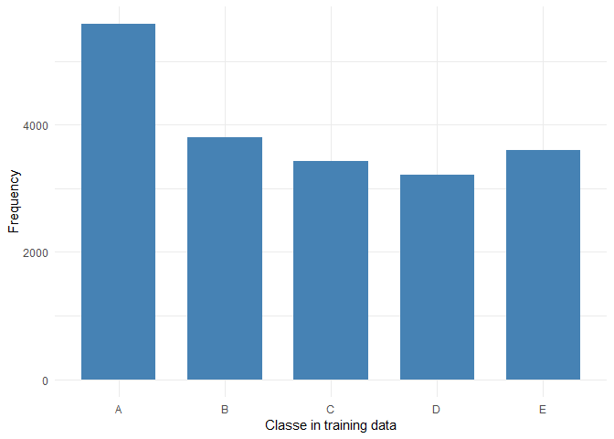
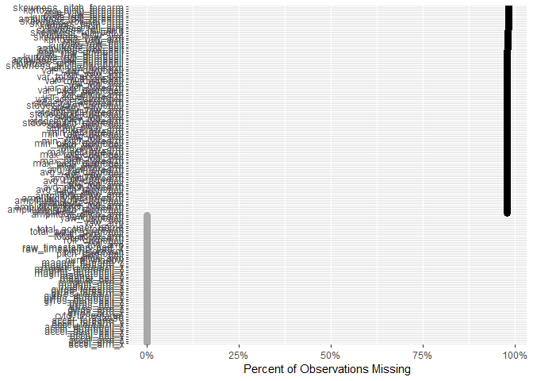
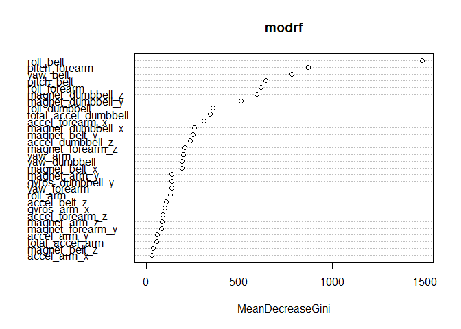
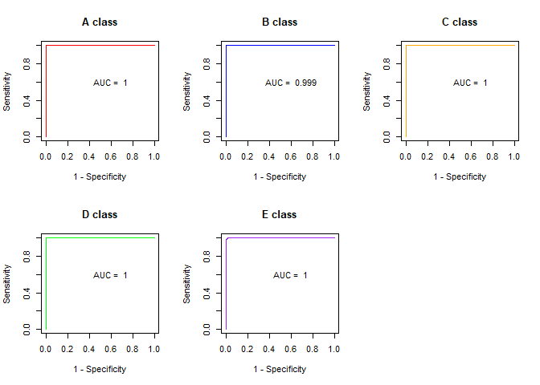

Project for practical machine learning (Coursera)
================

``` r
knitr::opts_chunk$set(echo = TRUE, message=FALSE, warning=FALSE, cache = TRUE)
```

### Background:

Using devices such as Jawbone Up, Nike FuelBand, and Fitbit it is now
possible to collect a large amount of data about personal activity
relatively inexpensively. These type of devices are part of the
quantified self movement – a group of enthusiasts who take measurements
about themselves regularly to improve their health, to find patterns in
their behavior, or because they are tech geeks. One thing that people
regularly do is quantify how much of a particular activity they do, but
they rarely quantify how well they do it. In this project, your goal
will be to use data from accelerometers on the belt, forearm, arm, and
dumbell of 6 participants. They were asked to perform barbell lifts
correctly and incorrectly in 5 different ways. More information is
available from the website here:
<http://groupware.les.inf.puc-rio.br/har> (see the section on the Weight
Lifting Exercise Dataset).

The goal of your project is to predict the manner in which they did the
exercise. This is the “classe” variable in the training set. You may use
any of the other variables to predict with. You should create a report
describing how you built your model, how you used cross validation, what
you think the expected out of sample error is, and why you made the
choices you did. You will also use your prediction model to predict 20
different test cases.

### Data preparation and feature selection:

Firstly, I imported the training and testing dataset. I replaced the
data “\#DIV/0\!” as NA in the training set. After which, I dropped all
the columns with no values and examined the data using summary()

``` r
#import dataset
train <- read.csv("C:/Users/leafy/Desktop/Courses/Practical Machine Learning/pml-training.csv")
test <- read.csv("C:/Users/leafy/Desktop/Courses/Practical Machine Learning/pml-testing.csv")

# replace #DIV/0! as NA in training set
for (i in colnames(train)[7:length(colnames(train)) - 1 ]){
  train[[i]] <- gsub("#DIV/0!", "", train[[i]])
  train[[i]] <- as.numeric(train[[i]])
}

# drop all columns with no values
library(janitor)
train <- train %>% remove_empty(c("cols"))

#str(train)
#summary(train)

#str(test)
#summary(test)
```

I plotted the outcome variable “classes” from the training dataset using
ggplot function.

``` r
#data exploration of outcome variable: classe
library(ggplot2)
ggplot(train, aes(x=factor(classe)))+
  geom_bar(stat="count", width=0.7, fill="steelblue")+
  xlab("Classe in training data") + ylab("Frequency")+
  theme_minimal()
```

<!-- -->

Following which, I plotted the missingness of the training
dataset.Despite the clustering of the graph, it does show that there are
many variables with more than 80% missing values. These variables need
to be excluded as it is difficult to impute these variables.

``` r
#check for missing data
library(healthcareai)
missingness(train) %>% 
  plot()
```

<!-- -->

``` r
#identify variables with more than 20% missing data
missing_data_variable <- c(NA)

for (i in colnames(train)){
  number <- sum(is.na(train[[i]]))/nrow(train) * 100
  if (number >= 80){
    missing_data_variable <- c(missing_data_variable, i)
  }
}

missing_data_variable <- missing_data_variable[2:length(missing_data_variable)]
```

Variables with more than 80% of missing values were excluded.Prior to
model selection, I separated the dataset into training, test and
validation dataset using the respective percentages: 60%, 20% and 20%. I
preprocessed the training dataset using “knnImpute” method and using
this preprocess template, I imputed the missing values of training, test
and validation dataset using KNN method (It seems from the graph above
that there is no missing data. However, I am doing this in case the
percentage of missing data is too small to be detected from the graph).

I included all 52 features in my model training, as it was shown using
the Boruta Package that all 52 features are important (Not shown here as
it slowed down the processing time for this
document).

``` r
#selecting relevant variables and remove variables more than 20% missing data
library(dplyr)
train_1 <- train %>% select(colnames(train)[7:length(colnames(train))])
for (i in missing_data_variable){
  train_1 <- train_1 %>% select(-i)
}

#separate data into training and test/validation set
library(caret)
inTrain <- createDataPartition(y = train_1$classe,
                               p = 0.60,
                               list = FALSE)
training <- train_1[inTrain,]
testvalid <- train_1[-inTrain,]

inTest <- createDataPartition(y = testvalid$classe,
                               p = 0.5,
                               list = FALSE)
testing <- testvalid[inTest,]
validation <- testvalid[-inTest,]

library(RANN)
#using k-nearest neighbour imputation to impute data.
#use training data to impute data for testing set
#consider MICE???
preObj <- preProcess(training[, - 53], method = "knnImpute")
capAve_train <- predict(preObj, training[,- 53])
train_impute <- cbind(capAve_train, training$classe)
names(train_impute)[names(train_impute)== "training$classe"] <- "classe"
capAve_test <- predict(preObj, testing[,- 53])
test_impute <- cbind(capAve_test, testing$classe)
names(test_impute)[names(test_impute)== "testing$classe"] <- "classe"
capAve_validation <- predict(preObj, validation[,- 53])
validation_impute <- cbind(capAve_validation, validation$classe)
names(validation_impute)[names(validation_impute)== "validation$classe"] <- "classe"
```

### Model training and selection

The first model that I have built was a logistic regression. Using
multinom function from nnet, the accuracy of the model (0.73) certainly
can be improved on.

``` r
# first model: glm (logistic regression for multiclass classification)
library(nnet)
set.seed(131)
modelglm <- nnet::multinom(classe ~., data = train_impute)
```

    ## # weights:  270 (212 variable)
    ## initial  value 18952.740857 
    ## iter  10 value 12713.003163
    ## iter  20 value 10707.189001
    ## iter  30 value 10188.676163
    ## iter  40 value 9858.379167
    ## iter  50 value 9394.244945
    ## iter  60 value 9013.276483
    ## iter  70 value 8615.179829
    ## iter  80 value 8442.563118
    ## iter  90 value 8347.012009
    ## iter 100 value 8201.813966
    ## final  value 8201.813966 
    ## stopped after 100 iterations

``` r
# Make predictions
test_class_glm <- modelglm %>% predict(test_impute)

confusionMatrix(test_impute$classe, test_class_glm)
```

    ## Confusion Matrix and Statistics
    ## 
    ##           Reference
    ## Prediction   A   B   C   D   E
    ##          A 940  48  67  52   9
    ##          B  95 495  75  30  64
    ##          C  80  51 478  48  27
    ##          D  43  26  64 469  41
    ##          E  31  97  45  67 481
    ## 
    ## Overall Statistics
    ##                                           
    ##                Accuracy : 0.7298          
    ##                  95% CI : (0.7156, 0.7436)
    ##     No Information Rate : 0.3031          
    ##     P-Value [Acc > NIR] : < 2.2e-16       
    ##                                           
    ##                   Kappa : 0.6576          
    ##                                           
    ##  Mcnemar's Test P-Value : 4.423e-08       
    ## 
    ## Statistics by Class:
    ## 
    ##                      Class: A Class: B Class: C Class: D Class: E
    ## Sensitivity            0.7906   0.6904   0.6557   0.7042   0.7733
    ## Specificity            0.9356   0.9177   0.9355   0.9466   0.9273
    ## Pos Pred Value         0.8423   0.6522   0.6988   0.7294   0.6671
    ## Neg Pred Value         0.9113   0.9298   0.9225   0.9399   0.9560
    ## Prevalence             0.3031   0.1828   0.1858   0.1698   0.1586
    ## Detection Rate         0.2396   0.1262   0.1218   0.1196   0.1226
    ## Detection Prevalence   0.2845   0.1935   0.1744   0.1639   0.1838
    ## Balanced Accuracy      0.8631   0.8040   0.7956   0.8254   0.8503

The second model that I have built was a decision tree, using rpart
function. The accuracy is similar to the previous logistic regression
(0.75).

``` r
#second model: decision tree (rpart) 
library(rpart)
set.seed(131)
modrpart <- rpart(classe ~., data = train_impute)

# Make predictions
test_class_rpart <- modrpart  %>% predict(test_impute, type = "class")

confusionMatrix(test_impute$classe, test_class_rpart)
```

    ## Confusion Matrix and Statistics
    ## 
    ##           Reference
    ## Prediction    A    B    C    D    E
    ##          A 1015   37   20   17   27
    ##          B  119  459   65   57   59
    ##          C   20   64  531   48   21
    ##          D   40   63   95  400   45
    ##          E   23   56   66   40  536
    ## 
    ## Overall Statistics
    ##                                           
    ##                Accuracy : 0.7497          
    ##                  95% CI : (0.7358, 0.7632)
    ##     No Information Rate : 0.3102          
    ##     P-Value [Acc > NIR] : < 2.2e-16       
    ##                                           
    ##                   Kappa : 0.6823          
    ##                                           
    ##  Mcnemar's Test P-Value : 2.045e-15       
    ## 
    ## Statistics by Class:
    ## 
    ##                      Class: A Class: B Class: C Class: D Class: E
    ## Sensitivity            0.8340   0.6760   0.6834   0.7117   0.7791
    ## Specificity            0.9627   0.9075   0.9514   0.9277   0.9428
    ## Pos Pred Value         0.9095   0.6047   0.7763   0.6221   0.7434
    ## Neg Pred Value         0.9280   0.9305   0.9241   0.9506   0.9525
    ## Prevalence             0.3102   0.1731   0.1981   0.1433   0.1754
    ## Detection Rate         0.2587   0.1170   0.1354   0.1020   0.1366
    ## Detection Prevalence   0.2845   0.1935   0.1744   0.1639   0.1838
    ## Balanced Accuracy      0.8983   0.7918   0.8174   0.8197   0.8609

Going beyond the course, I have attempted to built a neural network as
my third model. The accuracy is certainly better than the previous two
models (0.905).

``` r
#third model: neural network
library(nnet)
set.seed(131)
a = nnet(classe ~., data = train_impute, size= 17, maxit=1000)
```

    ## # weights:  991
    ## initial  value 23932.658630 
    ## iter  10 value 13545.890019
    ## iter  20 value 9297.365171
    ## iter  30 value 6101.926547
    ## iter  40 value 4592.936756
    ## iter  50 value 3915.768527
    ## iter  60 value 3456.494635
    ## iter  70 value 2957.413829
    ## iter  80 value 2484.728099
    ## iter  90 value 2186.355550
    ## iter 100 value 1938.606924
    ## iter 110 value 1775.450278
    ## iter 120 value 1644.144460
    ## iter 130 value 1550.300350
    ## iter 140 value 1459.557862
    ## iter 150 value 1390.942992
    ## iter 160 value 1324.691608
    ## iter 170 value 1263.896656
    ## iter 180 value 1214.120511
    ## iter 190 value 1171.873564
    ## iter 200 value 1134.702187
    ## iter 210 value 1095.074943
    ## iter 220 value 1059.044874
    ## iter 230 value 1026.494977
    ## iter 240 value 997.226976
    ## iter 250 value 972.781854
    ## iter 260 value 949.017948
    ## iter 270 value 924.133126
    ## iter 280 value 889.912642
    ## iter 290 value 863.995689
    ## iter 300 value 840.652837
    ## iter 310 value 822.044599
    ## iter 320 value 798.343987
    ## iter 330 value 781.888220
    ## iter 340 value 763.486505
    ## iter 350 value 746.192765
    ## iter 360 value 730.662066
    ## iter 370 value 716.034180
    ## iter 380 value 702.730166
    ## iter 390 value 691.882890
    ## iter 400 value 681.352315
    ## iter 410 value 671.106549
    ## iter 420 value 660.265510
    ## iter 430 value 650.456529
    ## iter 440 value 642.669506
    ## iter 450 value 635.876990
    ## iter 460 value 630.378371
    ## iter 470 value 624.570808
    ## iter 480 value 615.545235
    ## iter 490 value 607.454473
    ## iter 500 value 602.204081
    ## iter 510 value 596.633694
    ## iter 520 value 592.203843
    ## iter 530 value 588.704175
    ## iter 540 value 586.126515
    ## iter 550 value 584.320802
    ## iter 560 value 582.374811
    ## iter 570 value 580.358497
    ## iter 580 value 577.006586
    ## iter 590 value 574.416211
    ## iter 600 value 571.871239
    ## iter 610 value 569.839525
    ## iter 620 value 567.621167
    ## iter 630 value 565.479919
    ## iter 640 value 562.559237
    ## iter 650 value 558.932246
    ## iter 660 value 556.552862
    ## iter 670 value 554.435706
    ## iter 680 value 551.811298
    ## iter 690 value 548.860446
    ## iter 700 value 545.687122
    ## iter 710 value 542.892199
    ## iter 720 value 540.261414
    ## iter 730 value 537.966233
    ## iter 740 value 535.152753
    ## iter 750 value 532.944220
    ## iter 760 value 530.704404
    ## iter 770 value 528.591208
    ## iter 780 value 526.353710
    ## iter 790 value 523.967144
    ## iter 800 value 522.711061
    ## iter 810 value 521.684415
    ## iter 820 value 520.432261
    ## iter 830 value 519.642421
    ## iter 840 value 518.612580
    ## iter 850 value 517.628195
    ## iter 860 value 517.079191
    ## iter 870 value 516.595926
    ## iter 880 value 516.131381
    ## iter 890 value 515.696137
    ## iter 900 value 515.275148
    ## iter 910 value 514.793477
    ## iter 920 value 514.123268
    ## iter 930 value 511.224327
    ## iter 940 value 509.897276
    ## iter 950 value 508.416650
    ## iter 960 value 507.396243
    ## iter 970 value 506.824780
    ## iter 980 value 506.073986
    ## iter 990 value 504.751119
    ## iter1000 value 503.555968
    ## final  value 503.555968 
    ## stopped after 1000 iterations

``` r
library(caret)
b <- predict(a, newdata=test_impute,type="class")
b <- as.factor(b)
confusionMatrix(test_impute$classe, b)
```

    ## Confusion Matrix and Statistics
    ## 
    ##           Reference
    ## Prediction    A    B    C    D    E
    ##          A 1056   27    8   17    8
    ##          B   26  675   22   14   22
    ##          C    9   29  591   30   25
    ##          D   15   14   31  562   21
    ##          E    3   23   16   13  666
    ## 
    ## Overall Statistics
    ##                                           
    ##                Accuracy : 0.9049          
    ##                  95% CI : (0.8953, 0.9139)
    ##     No Information Rate : 0.2827          
    ##     P-Value [Acc > NIR] : <2e-16          
    ##                                           
    ##                   Kappa : 0.8797          
    ##                                           
    ##  Mcnemar's Test P-Value : 0.6937          
    ## 
    ## Statistics by Class:
    ## 
    ##                      Class: A Class: B Class: C Class: D Class: E
    ## Sensitivity            0.9522   0.8789   0.8847   0.8836   0.8976
    ## Specificity            0.9787   0.9734   0.9714   0.9754   0.9827
    ## Pos Pred Value         0.9462   0.8893   0.8640   0.8740   0.9237
    ## Neg Pred Value         0.9811   0.9706   0.9762   0.9774   0.9763
    ## Prevalence             0.2827   0.1958   0.1703   0.1621   0.1891
    ## Detection Rate         0.2692   0.1721   0.1507   0.1433   0.1698
    ## Detection Prevalence   0.2845   0.1935   0.1744   0.1639   0.1838
    ## Balanced Accuracy      0.9654   0.9261   0.9281   0.9295   0.9401

The fourth model that I have built was a random forest (Accuracy =
0.994).

``` r
#Fourth model: random forest ->  all 52 variables are important
library(randomForest)
set.seed(131)
modrf_org <-randomForest(classe ~., data = train_impute)

# Make predictions
test_class_rf_org <- modrf_org %>% predict(test_impute, type = "class")
test_prob_rf_org <- modrf_org %>% predict(test_impute, type = "prob")
confusionMatrix(test_impute$classe, test_class_rf_org)
```

    ## Confusion Matrix and Statistics
    ## 
    ##           Reference
    ## Prediction    A    B    C    D    E
    ##          A 1115    1    0    0    0
    ##          B    6  751    2    0    0
    ##          C    0    3  681    0    0
    ##          D    0    0    8  635    0
    ##          E    0    0    0    2  719
    ## 
    ## Overall Statistics
    ##                                           
    ##                Accuracy : 0.9944          
    ##                  95% CI : (0.9915, 0.9965)
    ##     No Information Rate : 0.2858          
    ##     P-Value [Acc > NIR] : < 2.2e-16       
    ##                                           
    ##                   Kappa : 0.9929          
    ##                                           
    ##  Mcnemar's Test P-Value : NA              
    ## 
    ## Statistics by Class:
    ## 
    ##                      Class: A Class: B Class: C Class: D Class: E
    ## Sensitivity            0.9946   0.9947   0.9855   0.9969   1.0000
    ## Specificity            0.9996   0.9975   0.9991   0.9976   0.9994
    ## Pos Pred Value         0.9991   0.9895   0.9956   0.9876   0.9972
    ## Neg Pred Value         0.9979   0.9987   0.9969   0.9994   1.0000
    ## Prevalence             0.2858   0.1925   0.1761   0.1624   0.1833
    ## Detection Rate         0.2842   0.1914   0.1736   0.1619   0.1833
    ## Detection Prevalence   0.2845   0.1935   0.1744   0.1639   0.1838
    ## Balanced Accuracy      0.9971   0.9961   0.9923   0.9972   0.9997

I suspected that overfitting might have occurred as the accuracy seems
too good. To overcome this issue, I have attempted to build a
regularized random forest model using RRF() function. Even though the
accuracy is lower as compared to the previous model, the accuracy is
more reasonable (0.987) and it is hoped that the regularized random
forest model can better predicted the test set given in the assessment.

``` r
#Last model: random forest ->  all 52 variables are important
library(RRF)
set.seed(131)
modrf <-RRF(classe ~., data = train_impute)

# Make predictions
test_class_rf <- modrf %>% predict(test_impute, type = "class")
test_prob_rf <- modrf %>% predict(test_impute, type = "prob")
confusionMatrix(test_impute$classe, test_class_rf)
```

    ## Confusion Matrix and Statistics
    ## 
    ##           Reference
    ## Prediction    A    B    C    D    E
    ##          A 1111    3    1    0    1
    ##          B   11  737    7    1    3
    ##          C    0    5  677    2    0
    ##          D    1    1    7  634    0
    ##          E    0    4    1    4  712
    ## 
    ## Overall Statistics
    ##                                           
    ##                Accuracy : 0.9867          
    ##                  95% CI : (0.9827, 0.9901)
    ##     No Information Rate : 0.2863          
    ##     P-Value [Acc > NIR] : <2e-16          
    ##                                           
    ##                   Kappa : 0.9832          
    ##                                           
    ##  Mcnemar's Test P-Value : 0.1047          
    ## 
    ## Statistics by Class:
    ## 
    ##                      Class: A Class: B Class: C Class: D Class: E
    ## Sensitivity            0.9893   0.9827   0.9769   0.9891   0.9944
    ## Specificity            0.9982   0.9931   0.9978   0.9973   0.9972
    ## Pos Pred Value         0.9955   0.9710   0.9898   0.9860   0.9875
    ## Neg Pred Value         0.9957   0.9959   0.9951   0.9979   0.9988
    ## Prevalence             0.2863   0.1912   0.1767   0.1634   0.1825
    ## Detection Rate         0.2832   0.1879   0.1726   0.1616   0.1815
    ## Detection Prevalence   0.2845   0.1935   0.1744   0.1639   0.1838
    ## Balanced Accuracy      0.9938   0.9879   0.9874   0.9932   0.9958

From the vapImpPlot() function, the top 5 important predictors from the
random forest are: row\_belt,pitch\_forearm, vaw\_belt, pitch\_belt and
roll\_forearm.

``` r
#variable importance
RRF::varImpPlot(modrf)
```

<!-- -->

To determine how good the model is, I have generated the AUC using
multiclass.roc() function. The AUC function is 0.999. In addition, I
have plotted the ROC curves for all the 5 classes, with the AUC of all
the 5 classes being 0.999 - 1.

``` r
#Multiclass ROC 
library(pROC)
library(ROCR)
multiclass.roc(test_impute$classe, test_prob_rf)
```

    ## 
    ## Call:
    ## multiclass.roc.default(response = test_impute$classe, predictor = test_prob_rf)
    ## 
    ## Data: multivariate predictor test_prob_rf with 5 levels of test_impute$classe: A, B, C, D, E.
    ## Multi-class area under the curve: 0.9997

``` r
test_prob_rf_df <- as.data.frame(test_prob_rf)
train_impute_5class <- train_impute %>% mutate(A_class = ifelse(classe == "A", 1, 0)) %>%
                                        mutate(B_class = ifelse(classe == "B", 1, 0))  %>%
                                        mutate(C_class = ifelse(classe == "C", 1, 0)) %>%
                                        mutate(D_class = ifelse(classe == "D", 1, 0)) %>%
                                        mutate(E_class = ifelse(classe == "E", 1, 0))

test_impute_5class <- test_impute %>% mutate(A_class = ifelse(classe == "A", 1, 0)) %>%
                                        mutate(B_class = ifelse(classe == "B", 1, 0))  %>%
                                        mutate(C_class = ifelse(classe == "C", 1, 0)) %>%
                                        mutate(D_class = ifelse(classe == "D", 1, 0)) %>%
                                        mutate(E_class = ifelse(classe == "E", 1, 0))

roc_a <- roc(test_impute_5class$A_class, test_prob_rf_df[,1])
pda <- prediction(test_prob_rf_df[,1], test_impute_5class$A_class)
pfa <- performance(pda, "tpr","fpr")

roc_b <- roc(test_impute_5class$B_class, test_prob_rf_df[,2])
pdb <- prediction(test_prob_rf_df[,2], test_impute_5class$B_class)
pfb <- performance(pda, "tpr","fpr")

roc_c <- roc(test_impute_5class$C_class, test_prob_rf_df[,3])
pdc <- prediction(test_prob_rf_df[,3], test_impute_5class$C_class)
pfc <- performance(pda, "tpr","fpr")

roc_d <- roc(test_impute_5class$D_class, test_prob_rf_df[,4])
pdd <- prediction(test_prob_rf_df[,4], test_impute_5class$D_class)
pfd <- performance(pda, "tpr","fpr")

roc_e <- roc(test_impute_5class$E_class, test_prob_rf_df[,5])
pde <- prediction(test_prob_rf_df[,5], test_impute_5class$E_class)
pfe <- performance(pdb, "tpr","fpr")

par(mfrow=c(2,3))
plot(pfa, col = "red", xlab = "1 - Specificity", ylab = "Sensitivity")
title(main="A class")
text(0.6, 0.6, paste("AUC = ", round(auc(roc_a), digits = 3)))
plot(pfb, horizontal=TRUE, col = "blue", xlab = "1 - Specificity", ylab = "Sensitivity")
title(main="B class")
text(0.6, 0.6, paste("AUC = ", round(auc(roc_b), digits = 3)))
plot(pfc, col = "orange", xlab = "1 - Specificity", ylab = "Sensitivity")
title(main="C class")
text(0.6, 0.6, paste("AUC = ", round(auc(roc_c), digits = 3)))
plot(pfd, horizontal=TRUE, col = "green", xlab = "1 - Specificity", ylab = "Sensitivity")
title(main="D class")
text(0.6, 0.6, paste("AUC = ", round(auc(roc_d), digits = 3)))
plot(pfe, horizontal=TRUE, col = "purple", xlab = "1 - Specificity", ylab = "Sensitivity")
title(main="E class")
text(0.6, 0.6, paste("AUC = ", round(auc(roc_e), digits = 3)))
```

<!-- -->

To validate the above model, I used the validation dataset to predict
based on the regularized random forest model and determine the accuracy
(0.988) as well as multi-class AUC. The multi-class AUC is 0.999. Hence,
I will use the regularized random forest model to predict the test set
given in the assignment.

``` r
#accuracy for validation set using regularized random forest
# Make predictions
validation_class_rf <- modrf %>% predict(validation_impute, type = "class")
validation_prob_rf <- modrf %>% predict(validation_impute, type = "prob")
confusionMatrix(validation_impute$classe, validation_class_rf)
```

    ## Confusion Matrix and Statistics
    ## 
    ##           Reference
    ## Prediction    A    B    C    D    E
    ##          A 1110    6    0    0    0
    ##          B    4  744   10    1    0
    ##          C    0    4  678    2    0
    ##          D    0    1   12  629    1
    ##          E    0    2    5    0  714
    ## 
    ## Overall Statistics
    ##                                          
    ##                Accuracy : 0.9878         
    ##                  95% CI : (0.9838, 0.991)
    ##     No Information Rate : 0.284          
    ##     P-Value [Acc > NIR] : < 2.2e-16      
    ##                                          
    ##                   Kappa : 0.9845         
    ##                                          
    ##  Mcnemar's Test P-Value : NA             
    ## 
    ## Statistics by Class:
    ## 
    ##                      Class: A Class: B Class: C Class: D Class: E
    ## Sensitivity            0.9964   0.9828   0.9617   0.9953   0.9986
    ## Specificity            0.9979   0.9953   0.9981   0.9957   0.9978
    ## Pos Pred Value         0.9946   0.9802   0.9912   0.9782   0.9903
    ## Neg Pred Value         0.9986   0.9959   0.9917   0.9991   0.9997
    ## Prevalence             0.2840   0.1930   0.1797   0.1611   0.1823
    ## Detection Rate         0.2829   0.1897   0.1728   0.1603   0.1820
    ## Detection Prevalence   0.2845   0.1935   0.1744   0.1639   0.1838
    ## Balanced Accuracy      0.9971   0.9890   0.9799   0.9955   0.9982

``` r
#Multiclass ROC curve
library(pROC)
library(ROCR)
multiclass.roc(validation_impute$classe, validation_prob_rf)
```

    ## 
    ## Call:
    ## multiclass.roc.default(response = validation_impute$classe, predictor = validation_prob_rf)
    ## 
    ## Data: multivariate predictor validation_prob_rf with 5 levels of validation_impute$classe: A, B, C, D, E.
    ## Multi-class area under the curve: 0.9996

I processed the test set similar from the training set: remove the
unnecessary variables and impute missing data. Following which, I used
the regularised random forest model to predict the classes for the test
data. From the summary data, there are 7 A class, 8 B class, 1 C class,
1 D class and 3 E class.

``` r
#accuracy for test set from assignment using regularized random forest

#remove unnessary variables from test set
test_1 <- test %>% select(colnames(test)[8:length(colnames(test))])
for (i in missing_data_variable){
  test_1 <- test_1 %>% select(-i)
}

test_1  <- test_1  %>% remove_empty(c("cols"))

#impute test data
test_1_impute  <- predict(preObj, test_1 [,- 53])

# Make predictions
test_1_class_rf <- modrf %>% predict(test_1_impute, type = "class")
test_1_prob_rf <- modrf %>% predict(test_1_impute, type = "prob")
test_1_class_rf
```

    ##  1  2  3  4  5  6  7  8  9 10 11 12 13 14 15 16 17 18 19 20 
    ##  B  A  B  A  A  E  D  B  A  A  B  C  B  A  E  E  A  B  B  B 
    ## Levels: A B C D E

``` r
summary(test_1_class_rf)
```

    ## A B C D E 
    ## 7 8 1 1 3
